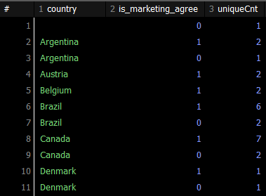
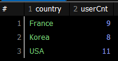
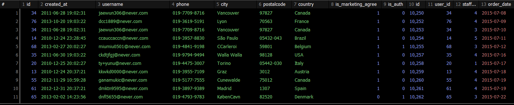

# Data를 Group으로 '묶어서' '계산합시다.'

## 데이터를 계산하는 함수
Excel에서 합계를 구하고, 평균을 계산하고, 개수를 세는 것과 같은 작업을 하는 것처럼 SQL에서도 동일한 작업이 가능합니다(그리고 비슷하게 생겼습니다). 문자열을 원하는 만큼 잘라내거나, 대/소문자를 변경하는 등의 함수로 나뉩니다.
  1. 집계 함수 : 합 / 평균 / 개수 세기 etc
  2. 일반 함수 : 문자열 slicing / 대소문자 변경 etc

### 그룹별로 집계 함수를 적용하기 위해 데이터를 나누는 GROUP BY
전체 데이터에 함수를 적용하기도 하지만, 그룹별로 수치를 도출하는 경우도 많습니다. 이상의 경우에는 GROUP BY를 이용해 데이터를 그룹으로 묶은 후 필요한 함수를 적용하는 방식을 사용합니다.
  - '국가별 회원 수를 집계해라.'
  - '일별 매출을 계산해라.'
등의 그룹화 기준을 지정하여 계산을 수행.
### GROUP BY로 계산한 결과를 다시 필터링하는 HAVING
GROUP BY는 말그대로 그룹화하는 경우를 말합니다. 이상에서 언급한 '국가별 회원 수를 집계'하는 것까지만 가능합니다. 하지만 거기에 더해서 '국가별 회원 수를 계산하고, 회원 수가 10 명 이상인 국가만 추출'하는 등의 추가적인 조건을 걸기 위해서는 _그룹화 이후에 조건을 설정_ 해야 합니다. 즉, _집계 함수로 계산한 결과 중에서 조건에 맞는 데이터_ 를 걸어야 합니다.

이상에서 중요한 것은 WHERE은 table 자체에 걸리는 조건이기 때문에 집계 함수 이전에 사용이 불가능하다는 점입니다.

### 집계 함수
1. COUNT() - 행(row)의 개수를 계산
  - 주어진 컬럼의 값이 null이 아닌 행의 개수를 반환.
2. AVG() - 평균
3. SUM() - 합
4. ROUND(데이터, 소수점표기자리) : 결과값을 소수점표기자리까지만 나타내도록 반올림하는 함수
예제 - 모든 행의 개수를 계산해서 출력
5. SUBSTR(컬럼명, 시작점, 종료점) : 컬럼명에서의 시작점을 기준으로 종료값까지의 데이터를 잘라내서 return
  - 주의 사항 : Java / Python / JS에서의 index 개념과 달리 1부터 시작하며, 종료점이 미만이 아니라 _이하_ 에 해당함.
  - 결과적으로 SUBSTR()을 사용하기 위해서는 원본 데이터를 볼 수 있어야 하므로 SELECT created_at FROM users;를 확인 후에 SUBSTR()을 적용해야 할 필요성이 있겠습니다.
6. LENGTH() : DB에 따라서 LEN()을 쓰기도 합니다.

```sql
SELECT COUNT(*)
FROM users;
```
예제 - country 컬럼의 데이터의 개수를 계산해서 출력
```sql
SELECT COUNT(country)
FROM users;
```
NULL 체크 여부 때문에 저희 기준으로 77이 나와야 하는데 결과값은 76이 되어야 정상입니다.

예제 - 회원 정보 테이블 users에서 존재하는 국가(country)를 세는 SQL문(중복 제외).
```sql
SELECT COUNT(DISTINCT country)
FROM users;
```
- DISTINCT : 중복을 제외한 결과값을 COUNT할 때 사용.

예제 - 제품 정보 테이블 products에서 최저가를 출력(정상 가격 기준으로).
```sql
SELECT MIN(price)
FROM products;
```

예제 - 제품 정보 테이블 products에서 정상 가격 기준으로 최고가를 출력.
```sql
SELECT MAX(price)
FROM products;
```

예제 - products에서 정상 가격의 합계를 출력.
```sql
SELECT SUM(price)
FROM products;
```

예제 - products에서 discount_price 기준으로 평균을 출력하시오.
```sql
SELECT ROUND(AVG(discount_price), 2) FROM products;
```

예제 - users에서 가입일(day/가입연월일출력) / 가입연월(month/가입연월출력) / 가입일시(created_at/시간까지 출력)
```sql
SELECT SUBSTR(created_at, 1, 10) AS day,
  SUBSTR(created_at, 1, 7) AS month,
  created_at
  FROM users;
```

예제 - users에서 이메일 문자열의 길이 추출
```sql
SELECT LENGTH(username), username FROM users;
```


### 집계 함수 요약
1. SUM(컬럼명) : 합계
2. AVG(컬럼명) : 평균
3. MIN(컬럼명) : 최소값
4. MAX(컬럼명) : 최대값
5. COUNT(컬럼명) : 개수
- DB 종류가 달라고 거의 동일하지만, 일부 함수는 DB마다 지원 여부가 다릅니다.

### 일반 함수 요약 : 데이터를 가공하거나 변형
1. ROUND(컬럼명, 소수점자리수) : 소수점 자리를 지정한 자리수까지 반올림하여 출력
2. SUBSTR(컬럼명, 시작점, 문자개수) : 문자열을 지정한 시작위치로부터 지정한 문자개수만큼 가져와 출력
  - 주의사항 : Java / Python / JS에서의 index 개념과 달리 1부터 시작하며, 종료점이 미만이 아니라 _이하_에 해당
  - 결과적으로 SUBSTR()을 사용하기 위해서는 원본 데이터를 볼 수 있어야 하므로 SELECT created_at FROM users;를 확인 후에 SUBSTR()을 적용해야 함
3. LENGTH(컬럼명) : 문자열의 길이을 출력
4. UPPER(컬럼명) : 알파벳 문자열을 대문자로 변경
5. LOWER(컬럼명) : 알파벳 문자열을 소문자로 변경
- 집계 함수는 _여러 행의 데이터를 하나의 결과값_ 으로 집계하는 반면, 일반 함수는 _한 행의 데이터에 하나의 결과값을 반환_ 합니다.
- 집계 함수는 _SELECT에서만 사용 가능_ 하지만 일반 함수는 SELECT 뿐만 아니라 WHERE 절에서도 사용 가능합니다.

## 연습 문제
1. products에서 정상 가격을 모두 더한 값을 출력(소수점 둘째자리까지 표기)
```sql
SELECT ROUND(SUM(price), 2)
FROM products;
```
2. products에서 id가 30 이하인 제품의 정상 가격의 평균을 출력(소수점 둘째자리까지 표기)
```sql
SELECT ROUND(AVG(price), 2)
FROM products
WHERE id <= 30;
```
3. users에서 가입일시가 2010-10 부터 2010-12까지인 회원 아이디를 중복 없이 COUNT 값 출력
```sql
SELECT COUNT(DISTINCT id)
FROM users
WHERE created_at BETWEEN '2010-10' AND '2010-12';
```
4. users에서 이메일(username)의 길이가 17 자리 이하인 회원 수를 중복 없이 COUNT 값 출력
```sql
SELECT COUNT(DISTINCT id)
FROM users
WHERE LENGTH(username) <= 17;
```

## GROUP BY
### 어떤 기준으로 묶을지
- 집계함수만으로 원하는 결과를 얻을 수 없을 때가 있습니다. 데이터 전체가 아니라 원하는 기준으로 그룹을 나눠서 계산할 일이 있기 때문입니다.

예제 - users에서 country가 Korea인 회원의 수 출력
```sql
SELECT COUNT(DISTINCT id) AS uniqueUserCnt
FROM users
WHERE country = 'Korea';
```
- 현재 한국의 회원 수만 나오기 때문에, 국가별 회원 수를 전부 알고 싶다면 사용하는 것이 GROUP BY 입니다.

예제 - users에서 국가별 회원 수를 출력
```sql
SELECT country, COUNT(DISTINCT id)
FROM users
GROUP BY country;
```
- GROUP BY는 집계 함수와 함께 사용되며, GROUP BY 기준 컬럼은 SELECT 에서 집계 함수를 사용할 때 묶어서 계산을 수행하는 _기준_ 이 됩니다. 그룹으로 나뉜 결과에 따라 집계 함수가 적용되어 결과를 출력합니다.

예제 - users에서 country가 Korea인 회원 중 마케팅 수신 동의한 회원수를 출력(그냥 WHERE 절 써도 됨)
```sql
SELECT COUNT(DISTINCT id) AS uniqueCnt
FROM users
WHERE country = 'Korea' AND is_marketing_agree = 1;
```

예제 - users에서 country 별로 마케팅 수신 동의한 회원 수 / 동의하지 않은 회원 수 동시에 출력
```sql
SELECT country, is_marketing_agree, COUNT(id) AS uniqueCnt
FROM users
GROUP BY country, is_marketing_agree
ORDER BY country ASC, is_marketing_agree DESC;
```

GROUP BY에 두 개 이상의 기준 컬럼을 추가하면 데이터가 여러 그룹으로 나뉩니다. 결과 화면 상에서 Argentina가 입력된 row가 2개입니다. 하나는 Argentina이면서 is_marketing_agree = 1인 row의 개수(회원 수) / 다른 하나는 Argentina이면서 is_marketing_agree = 0인 row의 개수를 뜻합니다. country로 먼저 그룹화가 이루어지고 is_marketing_agree를 기준으로 두 번쨰 그룹화가 이루어졌습니다. 즉 그룹화 조건의 순서도 중요하다는 점입니다.


예제 - users에서 국가 내 도시별 회원 수를 출력(국가명은 알파벳순으로 정렬하고, 같은 국가 내에서는 회원 수 기준으로 내림차순으로 정렬)
```sql
SELECT COUNT(DISTINCT id) AS city_id, country, city
FROM users
GROUP BY country, city
ORDER BY country ASC, city_id DESC;
```

- 차원(dimension) : 분석 시에 좌표를 그룹으로 묶는 기준
- 매트릭(metric) : 각 차원에 대한 연산을 수행할 때 사용하는 계산식

쿼리문에 적용한다면 차원은 country / city에 해당하고, 매트릭은 COUNT(DISTINCT id)에 해당합니다.

예제 - users에서 월별 가입 회원수를 출력. created_at을 활용하고, 최신순으로 정렬(내림차순)
```sql
SELECT SUBSTR(created_at, 1, 7) AS MONTH, COUNT(DISTINCT id)
FROM users
GROUP BY SUBSTR(created_at, 1, 7) # MONTH
ORDER BY MONTH DESC;
```

### GROUP BY 요약
GROUP BY는 그룹별로 수치를 계산할 때 사용, 쉼표(,)를 써서 그룹화 기준을 복수로 지정 가능.
  - 두 개 이상의 기준을 지정할 때 컬럼 순서에 따라 그룹의 층위가 정해지므로 순서를 명확하게 지정해야 함.
* 참조 1 : GROUP BY를 쓸 때에는 적은 컬럼을 기준으로 SELECT에도 동일한 순서로 적어 계산된 수치의 기준을 알려주는게 더 좋습니다.
```sql
SELECT COUNT(id) AS userCnt
FROM users
GROUP BY country, city;
```
이렇게 작성하면 컬럼은 1개입니다. 그럼 그냥 숫자들만 있는 상황이니까 쿼리를 직접 읽어보지 않는다면 어느 국가의 어느 도시의 회원 수인지 알 수 없습니다.
```sql
SELECT country, city, COUNT(id) AS userCnt
FROM users
GROUP BY country, city;
```
처럼 작성하는게 좋습니다.
* 참조 2 : 기존에 있는 컬럼들을 먼저 써주고, 그것에 대한 연산을 뒤에 써주게 된다면, 차원 / 매트릭이 서로 분리가 됨. 차원1, 차원2, 연산1, 연산2 같은 순서로.

## 연습문제
1. orderdetails에서 주문 아이디 별 수량의 총합을 출력(주문 수량의 총합이 내림 차순으로)
```sql
SELECT order_id, SUM(quantity)AS id_sum
FROM orderdetails
GROUP BY order_id
ORDER BY id_sum DESC;
```
2. orders에서 직원 아이디 별, 회원 아이디 별로 주문 건수를 출력(단, 직원 아이디 기준 오름 차순으로 먼저 정렬한 뒤 주문 건수 기준 내림 차순으로 정렬)
```sql
SELECT staff_id, user_id, COUNT(order_date) AS order_count
FROM orders
GROUP BY staff_id, user_id
ORDER BY staff_id, order_count DESC;
```
3. orders에서 월별로 주문한 회원 수를 출력(주문일자(order_date) 컬럼을 활용하고, 최신 순으로 정렬)
```sql
SELECT SUBSTR(order_date, 1, 7) AS MONTH, COUNT(DISTINCT user_id) AS uniqueUserCnt
FROM orders
GROUP BY SUBSTR(order_date, 1, 7)
ORDER BY order_date DESC;
```

## HAVING
- 집계 값을 다시 필터링하는 HAVING
- GROUP BY를 이용해 그룹화하고, 해당 그룹별로 집계 함수를 사용하여 연산을 수행했습니다. 이 방법으로 국가별 회원 수를 출력하는 작업을 했습니다.
- 추가적으로 국가별 회원 수가 n명 이상인 국가의 회원 수만 보기 위해서는
  - 조건이 아니라 GROUPING을 해야 하고 그 결과값에 조건을 걸 필요가 있습니다.

예제 - users에 country가 Korea / USA / France인 회원 수를 국가별로 출력
```sql
SELECT country, COUNT(DISTINCT id) AS userCnt
FROM users
WHERE country IN ('Korea','USA','France')
GROUP BY country;
```


회원 수가 8명 이상인 국가의 회원 수를 미리 확인하지 않고 바로 SQL문으로 해결하는 방법을 기준으로 하겠습니다
SELECT country, COUNT(DISTINCT id) AS userCnt
FROM users
WHERE COUNT(DISTINCT id) > 7
GROUP BY country;
집계합수는 SELECT문에만 사용할 수 있어 이상의 SQL문은 실행되지 않습니다.
```sql
SELECT country, COUNT(DISTINCT id) AS userCnt
FROM users
GROUP BY country
HAVING COUNT(DISTINCT id) > 7 # userCnt도 가능
ORDER BY 2 DESC; -- 2번째 컬럼을 기준으로 정렬하라는 의미
```

* WHERE 절에서 필터링할 때 에러가 난 이유:
  - 실행하는 쿼리의 순서와 관계있습니다.
  - WHERE의 경우 GROUP BY보다 먼저 실행되며, 컴퓨터가 그룹화를 하기 이전에 조건을 검토하는데, 집계함수로 계산된 값은 GROUP BY 실행 후에 계산되기 때문에 순서상의 오류가 나옵니다.

예제 - orders에서 담당 직원별(staff_id) 주문 건수와 주문 회원 수를 계산하고, 주문 건수가 10건 이상이면서 주문 회원 수가 40명 이하를 출력 (단, 주문 건수 기준으로 내림 차순 정렬. staff_id / user_id / id 컬럼을 활용할 것)
```sql
SELECT staff_id, COUNT(id) AS orderCnt, COUNT(user_id) AS userCnt
FROM orders
GROUP BY staff_id
HAVING orderCnt > 9 AND userCnt < 41
ORDER BY orderCnt DESC;
```

### HAVING 요약
- HAVING은 `GROUP BY와 집계 함수`를 이용해서 그룹별로 집계한 값을 필터링할 때 사용
1. HAVING은 WHERE처럼 필터링 기능을 수행하지만, 적용 영역이 서로 다르다. _WHERE은 FROM에서 불러온 데이터를 직접 필터링_ 하지만 HAVING은 _GROUP BY가 실행된 이후의 집계 함수 값을 필터링_ 한다. 따라서 HAVING은 GROUP BY가 SELECT 문 내애 없다면 사용 자체가 불가능하다.
2. HAVING은 조건 연산자로 여러 조건문을 연결할 수 있으며, 연산이 작동되지 않은 기본 컬럼은 HAVING에서 사용할 수 없다.
3. 쿼리문의 실행 순서
```sql
SELECT        -- 5
FROM          -- 1
WHERE         -- 2
GROUP BY      -- 3
HAVING        -- 4
ORDER BY      -- 6
```
1. FROM을 읽어서 해당 테이블이 존재하는지, 존재한다면 그 테이블을 확인하는 작업을 실행
2. WHERE 절을 실행하여 가져올 데이터의 범위를 확인
3. GROUP BY를 통해서 DB에서 가져올 범위가 설정된 데이터에 의해 집계 연산을 적용할 수 있도록 데이터를 분할함
4. HAVING을 통해 직전의 단계에서 그룹화 되어진 데이터(집계연산이후)를 가지고 조건을 적용하여 데이터를 필터링함
5. SELECT가 실행되면서 필터링 범위가 그룹이 정해진 데이터에서 어떤 컬럼을 가지고 올지, 어떤 연산을 적용하여 값을 생성할지 결정
6. ORDER BY를 통해 제시 / 생성된 컬럼을 기준으로 어떤 방식으로 데이터를 나열할지 결정

## 연습문제
1. orders에서 회원별 주문 건수룰 출력(단 주문 건수가 7건 이상인 회원의 정보만 출력하고, 주문 건수 기준으로 내림 차순 정렬 user_id와 id)
```sql
SELECT user_id, COUNT(user_id) AS userCnt
FROM orders
GROUP BY user_id
HAVING userCnt > 6
ORDER BY userCnt DESC;
```
2. users에서 국가별 도시 수와 국가별 회원(id) 수를 출력(단, 도시 수가 5개 이상이고 회원 수가 3명 이상인 정보만 출력, 도시 수, 회원 수 기준으로 모두 내림 차순 정렬)
```sql
SELECT country, COUNT(city) AS cityCnt, COUNT(id) AS idCnt
FROM users
GROUP BY country
HAVING cityCnt > 4 AND idCnt > 2
ORDER BY cityCnt DESC, idCnt DESC;
```
3. users에서 이하의 국가에 거주 중인 회원(id) 수를 국가별로 출력(단, 회원 수가 5명 이상인 국가만 출력, 회원 수 기준으로 내림 차순 정렬)(USA / Brazil / Korea / Argentina / Mexico)
```sql
SELECT country, COUNT(id) AS idCnt
FROM users
WHERE country IN ('USA','Brazil','Korea','Argentina','Mexico')
GROUP BY country
HAVING  idCnt > 4
ORDER BY idCnt DESC;
```

# 여러 가지 데이터를 원하는대로 합치는 JOIN / UNION
- JOIN : 테이블을 좌우로 결합
- UNION : 테이블을 상하로 결합

## 정규화
SQL에서 데이터를 다루다보면 여러 테이블에 나뉘어 있는 데이터를 하나씩 모아서 봐야 하는 경우가 생깁니다. 즉, 테이블들을 미리 다 찢어놨다는 것을 의미합니다. 특정 정보를 보기 위해서 다양한 테이블을 합치는 과정이 필요한데, 이를 다 분할해둔 이유는 관계형 데이터베이스에서는 데이터의 중복을 피하고 쉽게 관리하기 위해서 데이터를 여러 곳에 나누어 보관합니다. 1 ~ 6 정규화까지 있는데, 실무에서는 약 3정규화 정도까지만 구현합니다.

## JOIN
주문 정보 테이블인 orders 직원 정보 테이블 staff를 합쳐보겠습니다. 두 테이블을 합칠때에는 공통된 부분이 있어야 합니다. JOIN은 두 테이블의 컬럼 구성이 달라도 결합이 가능하며, _합친 테이블 컬럼 수는 늘어납니다._

같인 테이블끼리의 JOIN을 수행하더라도 선택하는 JOIN 유형의 따라서 다른 결과 값이 나오게 됩니다. 그런데 결합을 위한 공통 분모인 Key가 존재하고, 이것이 PK / FK 개념에 해당합니다.

### 컬럼 목록이 다른 테이블을 좌우로 결합
테이블 하나를 기준으로 데이터를 다루는 연습을 했지만, 복수의 테이블에서도 필요한 정보들을 취합하여 출력할 수 있습니다.
- 국가별로 주문 건수를 알아보고 싶다면 ?
  - 국가 정보는 users 테이블에 있고, 주문 건수는 orders 테이블에 있으므로 users / orders를 동시에 다룰 필요가 있습니다.

예제 - 회원 정보 테이블 users와 주문 정보 테이블 orders를 하나로 결합하여 출력(단, 주문 정보가 있는 정보만 출력)
```sql
SELECT *
FROM users u INNER JOIN orders o ON u.id = o.user_id;
```

1로 시작되지 않음을 확인했을 때, users 테이블의 id 클럼의 값이 1인 row는 존재하지만, orders 테이블의 user_id 컬럼에는 1의 값을 지니는 row가 없기 때문에 최종 출력 결과에서 누락되었음을 알 수 있습니다.

두 테이블을 하나로 결합하려면 두 테이블에 공통된 부분이 존재해야 함. 관계형 데이터베이스에서는 이 부분을 키(Key)라고 합니다. 그래서 관계형 데이터베이서에서는 키 값이 테이블에 반드시 한 개 이상 존재하도록 설계되어있고, 테이블에서 개별 행을 '유일하게 구분' 짓습니다. 따라서 _키 값은 컬럼 내에서 중복되지 않으며 다른 개별 행을 구분해야 하므로 null 값을 가질 수도 없습니다._

* 참조 : 키 값은 테이블 내에서 고유한 값을 가지므로 한 테이블에서 개수를 계산할 때 중복되지 않습니다. 그런데 여러 테이블을 조인하면 키 값도 중복될 수 있습니다. 예를 들어서 회원 아이디가 7인 사람이 세 번 주문 했다면, 회원 정보와 주문 정보를 결합한 테이블에서는 회원 아이디가 7인 row가 3개 있을겁니다. 이떄 한번이라도 주문한 회원 수를 중복없이 구하려면 결국에는 DISTINCT 요구될겁니다.

users에 있는 id는 PK에 해당하고, orders에 있는 user_id는 FK에 해당합니다. 즉, PK와 FK의 결합을 통해서 JOIN이 이루어진다고 볼 수 있습니다. `그러면 논리적으로, FK는 중복이 가능합니다.`

### INNER JOIN
- 두 테이블의 키 값이 _일치하는 행만_ 가져오는 JOIN -> 집합의 개념으로 보자면 _교집합_ 에 해당합니다.
- u.id가 1인 정보가 o.user_id에 없었기 때문에 누락되었습니다.

### LEFT JOIN
```sql
SELECT *
FROM users u
LEFT OUTER JOIN orders o ON u.id = o.user_id
ORDER BY u.id;
```
OUTER는 생략가능.
INNER JOIN과 유사하게 테이블 두 개가 합쳐지기는 했습니다. INNER JOIN이 두 개의 집합에서의 교집합 부분만 출력하는 반면에, LEFT JOIN의 경우는 먼저 언급된 테이블의 전체 정보는 전부 다 출력하고, 그 중에서 orders 테이블과 일치하는 것들만 따로 더 가지고 오는 형태라고 할 수 있습니다.

데이터를 결합하는 경우 대부분 한쪽 테이블의 값을 보전해야 하는 경우가 많은데, LEFT (OUTER) JOIN이 이에 해당합니다.

하지만 주문 내역만 명확하게 보고 싶다면 INNER JOIN을 씁니다.
```sql
형식:
FROM 테이블1 a (LEFT/INNER) JOIN 테이블2 b ON a.PK = b.FK;
```
- LEFT : 왼쪽 테이블의 키 값이 오른쪽 테이블의 키 값과 _매칭되지 않는 행도_ 가지고 오는데, 왼쪽 테이블의 컬럼 값은 전부 다 출력하고, 오른쪽 테이블 컬럼 값은 null로 표기됨.
- INNER : 오른쪽 왼쪽 테이블에서 전부 정보 조회가 되는 값들만 출력함.
```sql
SELECT u.id, u.created_at, u.username, o.id, o.order_date, o.staff_id
FROM users u
LEFT JOIN orders o ON u.id = o.user_id
ORDER BY u.id;
```

예제 - users와 orders를 하나로 합치는데, 주문 정보가 없는 회원의 정보만 출력
```sql
SELECT *
FROM users u
LEFT JOIN orders o ON u.id = o.user_id
WHERE o.id IS null
ORDER BY u.id;
```
IS는 프로그래밍 언어에서 == null을 위주로 썻을 때 '=='에 해당한다고 보면 됨.

예제 - users와 orders 테이블을 하나로 결합하고, 추가로 orderdetails에 있는 데이터도 출력할 것(단, 주문 정보가 없는 회원의 주문 정보도 전부 출력하고, 다음 컬럼을 출력할 것. 회원 아이디 / 이메일 / 연락처 / 주문 아이디 / 제품 아이디)
```sql
SELECT u.id, u.username, u.phone, t.order_id, product_id
FROM users u
LEFT JOIN orders o ON u.id = o.user_id
LEFT JOIN orderdetails t ON o.id = t.order_id
ORDER BY u.id;
```