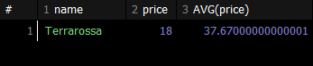

## RIGHT JOIN
```sql
# 주문 내역이 없는 회원도 출력
SELECT *
FROM users u
RIGHT JOIN orders o ON u.id = o.user_id
ORDER BY u.id;
```
차집합 개념을 들 수 있는데, LEFT JOIN과 동일한 기능을 하는 것 처럼 보입니다. 하지만 INNER JOIN과 결과값이 같습니다.
그래서 LEFT JOIN과 명확히 동일한 결과값을 만들기 위해서는 테이블 순서를 바꿀 필요가 있습니다.
  - 이와 같은 이유로 LEFT JOIN을 사용하도록 권장하는 편입니다. 먼저 나온 테이블이 기준이 되도록 해서 LEFT JOIN을 쓰던지, 아니면 교집합만 사용하기 위해 INNER JOIN을 씁니다.

## CROSS JOIN
```sql
FROM 테이블1 a CROSS JOIN 테이블2 b
```
두 집합을 _조합_ 해 만들 수 있는 _카레이산 곱_ 을 출력합니다. 순서는 u.id를 기준으로 작성해뒀습니다.
  - 조건 없이 두 테이블의 모든 행을 합쳐서 만들 수 있는 모든 경우의 수를 출력합니다. 예를 들어 10개의 row를 지니는 테이블과 20개의 row를 지니는 테이블을 CROSS JOIN하면 10 x 20으로 200개의 row를 지니는 행이 나오며, 이외의 경우의 수는 존재하지 않습니다. _모든_ 이 중요합니다. _조건_ 없습니다.

- CROSS JOIN과 유사해보이기는 하지만 조금 다른 FULL OUTER JOIN도 있습니다.
  - FULL OUTER JOIN = LEFT JOIN + RIGHT JOIN - INNER JOIN

## JOIN 정리
- LEFT (OUTER) JOIN : 왼쪽 테이블의 모든 데이터를 결과에 포함시켜서 출력.
- RIGHT (OUTER) JOIN : 오른쪽 테이블의 모든 데이터를 결과에 포함시켜서 출력.
- FULL OUTER JOIN : 좌우측 테이블의 모든 데이터를 결과에 포함시켜서 출력(CROSS와의 차이점에 유의할 것).
  - FULL OUTER JOIN은 조건에 부합할 때만 결과값을 만들어내지만 CROSS JOIN은 모든 경우의 수를 전체 출력.

## 연습문제
1. users와 staff를 참고하여 회원 중 직원인 사람의 회원 아이디, 이메일, 거주 도시, 거주 국가, 성, 이름을 출력
```sql
SELECT u.id, u.username, u.city, u.country, s.first_name, s.last_name
FROM users u INNER JOIN staff s ON u.id = s.user_id
ORDER BY u.id;
```
2. staff와 orders를 참고하여 직원 아이디가 3번, 5번인 직원의 담당 주문을 출력(단, 직원 아이디, 직원의 성, 주문 아이디, 주문 일지만 출력)
```sql
SELECT s.id, s.first_name, o.id, o.order_date
FROM orders o LEFT JOIN staff s ON o.staff_id = s.id
WHERE o.staff_id = 3 OR o.staff_id = 5
ORDER BY o.staff_id
```
3. users와 orders를 참고하여 회원 국가별 주문 건수를 내림차순으로 출력
```sql
SELECT u.country, COUNT(o.user_id) AS orderCnt
FROM users u INNER JOIN orders o ON u.id = o.user_id
GROUP BY u.country
ORDER BY orderCnt DESC;
```
4. orders와 orderdetails, product를 참고하여 회원 아이디 별 주문 금액의 총합을 정상가격과 할인 가격 기준으로 각각 출력(단, 정상 가격 주문 금액의 총합 기준으로 내림 차순)
```sql
SELECT o.user_id, SUM(p.price * od.quantity) AS normalPrice, SUM(p.discount_price * od.quantity) AS discountPrice
FROM orders o
LEFT JOIN orderdetails od ON o.id = od.order_id
LEFT JOIN products p ON od.product_id = p.id
GROUP BY o.user_id
ORDER BY normalPrice DESC;
```
5. 다음 조건의 테이블이 있다고 가정
  - 왼쪽 테이블 A : 컬럼 개수 5개 / 150행
  - 오른쪽 테이블 B : 컬럼 개수 7개 / 100행
  - 두 테이블은 공통 키 값 컬럼을 1개 보유
이상의 조건의 두 테이블을 CROSS / LEFT / RIGHT / INNER JOIN으로 결합 했을때 결과 테이블의 행과 열 개수를 계산 각각 최소/ 최대를 기준
CROSS JOIN - 테이블의 열(12), 행(15000) * 최대, 최소 동일
LEFT JOIN - 테이블의 열(12), 행(최소 : 150, 최대 : 15000)
RIGHT JOIN - 테이블의 열(12), 행(최소 : 100, 최대 : 15000)
INNER JOIN - 테이블의 열(12), 행(최소 : 0, 최대 : 15000)

# UNION
## 컬럼 목록이 같은 데이터를 위아래로 결합
- 데이터를 위아래로 수직 결합을 지원하는 UNION은 컬럼의 형식과 개수가 같은 두 데이터 결과 집합을 하나로 합친다고 볼 수 있습니다.
- 조건을 설정해서 결합해야하는 JOIN과 달리, UNION은 컬럼의 형식 / 개수만 동일하면 결합이 가능합니다.

예제 - users를 full scan한 결과 집합해서 UNION 적용
```sql
SELECT *
FROM users
UNION
SELECT *
FROM users;
```
결과가 'SELECT * FROM users;'와 동일합니다.
_UNION_ 은 중복 제거 기능이 있습니다.

예제 - users를 full scan한 결과 집합해서 UNION 적용(중복 제거 하지 않은 결과값 출력)
```sql
SELECT *
FROM users
UNION ALL -- ALL 추가
SELECT *
FROM users
```
UNION의 기본 전제 : 컬럼의 형식 / 개수 -> SELECT 수행 이후에 커스텀한 컬럼에서도 동일하게 적용됩니다.

```sql
SELECT *
FROM users
UNION ALL
SELECT id, phone, country, city
FROM users;
```
SQL문의 적용 순서에 관해 오류가 발생합니다.

결과적으로 SELECT 문이 수행된 이후의 결과값을 기준으로 UNION이 실행됩니다.(소괄호가 적용된 부분이 먼저 적용됩니다). 그렇다면 각각의 소괄호1, 2의 연산 결과는 서로 다른 컬럼의 개수를 가지게 되기 때문에 UNION ALL 연산이 불가능합니다.

예제 - users에서 country가 Korea인 회원 정보만 출력하고, Mexico인 회원 정보만 출력하여 결합. 컬럼은 id, phone, city, country만 출력하고, 최종 결과 집합은 country 기준으로 알파벳 순 정렬
```sql
SELECT id, phone, city, country
FROM users
WHERE country = 'Korea'
UNION ALL
SELECT id, phone, city, country
FROM users
WHERE country = 'Mexico'
ORDER BY country;
```

## UNION 정리
- 컬럼 형식 / 개수 조정이 중요합니다.
- 중복 제거가 들어가있습니다.
- 중복 되어도 상관없으면 UNION ALL을 씁니다.

## 연습문제
1. orders에서 order_date가 2015년 10월인 건과 2015년 12월인 건을 SELECT로 각각 뽑아서, 두 결과 집합을 UNION ALL을 사용해 결합. 최종 결과는 최신 순으로 정렬
```sql
SELECT SUBSTR(order_date, 1, 7) AS MONTH, COUNT(order_date)
FROM orders
WHERE SUBSTR(order_date, 1, 7) = '2015-10'
UNION ALL
SELECT SUBSTR(order_date, 1, 7) AS MONTH, COUNT(order_date)
FROM orders
WHERE SUBSTR(order_date, 1, 7) = '2015-12';
```
2. users에서 USA에 거주 중이면서 마케팅 수신 동의를 한 회원 정보와 France에서 거주중이면서 마케팅 수신 동의하지 않은 최원 정보를 SELECT로 각각 추출하고, 두 결과 집합을 UNION ALL을 사용해 하나로 결합.(단, 최종 결과는 id, phone, country, city, is_marketing_agree 컬럼만 출력하고, 거저 국가 기준 알파벳 순으로 정렬)
```sql
SELECT id, phone, country, city, is_marketing_agree
FROM users
WHERE country = 'USA' AND is_marketing_agree = 1
UNION ALL
SELECT id, phone, country, city, is_marketing_agree
FROM users
WHERE country = 'France' AND is_marketing_agree = 0
ORDER BY country;
```
3. UNION을 활용하여 orderdetails와 products를 FULL OUTER JOIN으로 결합하여 출력(어떻게 하면 UNION만으로 FULL OUTER JOIN을 구현)
```sql
SELECT *
FROM orderdetails od LEFT JOIN products p ON od.order_id = p.id
UNION
SELECT *
FROM orderdetails od RIGHT JOIN products p ON od.order_id = p.id;
```

# SubQuery
- SQL의 쿼리 결과를 테이블처럼 사용하는 쿼리 내부의 쿼리
- 기존에는 데이터를 결합할 때 이미 존재하는 테이블에 접근하여 결합을 했습니다. 하지만 SubQuery는 기존 테이블을 편집하여 만든 결과값을 기준으로 다시 쿼리를 실행하는 형태입니다.
- SubQuery는 SELECT 문 내의 여러 곳에서 사용이 가능한데, 사용하는 위치에 따라 불리는 이름이 다양합니다.

예제 - products에서 제품명과, 정상 가격을 모두 불러오고, 평균 정상 가격을 새로운 컬럼으로 각 행마다 출력
```sql
select AVG(price)
FROM products
```
row = 1 / column = 1인 테이블이 하나 나옵니다.

```sql
SELECT NAME, price,
	(select round(AVG(price),2)
	 FROM products) AS avgProduct
FROM products;
```
전체 price들의 총합을 row 개수만큼 나눈 평균값에 해당됩니다. SubQuery의 결과가 하나의 값만 있기 때문에 모든 row에 결과값이 동일하게 출력됩니다.

이처럼 _SELECT절에는 '단일 값을 반환'하는 SubQuery가 올 수 있는데_ 이를 '스칼라 SubQuery'라고 합니다.

결과 화면의 마지막 컬럼처럼 스칼라 SubQuery는 신규 컬럼으로 추가되어 모든 행에 _단일 값을 출력_ 합니다.
```sql
SELECT name, price, AVG(price)
FROM products
ORDER BY name DESC;
```


첫 행만 출력되거나 DB에 따라서는 GROUP BY가 없는 상태라서 오류가 발생합니다.
- 유의사항 : 스칼라 서브 쿼리를 작성할 때 _단일 값이 반환되도록 작성_ 해야한다는 점. 만약에 2개 이상의 집계 값을 기존 테이블에 추가하고 싶다면 스칼라 서브 쿼리를 나누어서 작성해야 합니다.

정상가 기준의 평균도 컬럼에 추가하고 싶다면 서브 쿼리 두 개가 병렬로 있어야 합니다.
```sql
SELECT name, price,
(SELECT ROUND(AVG(price),2) FROM products) AS avgPrice,
(SELECT ROUND(AVG(discount_price),2) FROM products) AS avgDiscountPrice
FROM products;
```

예제 - users에서 city 별 회원 수를 카운트 하고, 회원 수가 3명 이상인 도시명과 회원 수를 출력(단, 회원 수를 기준으로 내림 차순 정렬)
```sql
-- 서브쿼리없이 작성(그룹화 이후에 연산 수행)
SELECT city, COUNT(DISTINCT id) AS userCnt
FROM users
GROUP BY city
HAVING userCnt > 2
ORDER BY userCnt DESC;
-- FROM절에 서브쿼리로 작성(연산 먼저 수행)
SELECT *
FROM(SELECT city, COUNT(DISTINCT id) AS userCnt FROM users GROUP BY city) temp
WHERE userCnt > 2
ORDER BY userCnt DESC;
```
주요 사항
1. FROM 절 내에 서브 쿼리가 들어갔다는 점 -> 편집이 이루어진 새로운 테이블을 기준으로 새로운 쿼리문을 작성했다는 점
2. FROM 절 내에 서브 쿼리가 들어가는 것을 인라인 뷰라고 표현합니다.

## Inline View
1. 인라인 뷰 내에는 또 다른 서브 쿼리가 개수 제한 없이 중첩적으로 들어갈 수 있음.
2. 인라인 뷰의 서브 쿼리는 괄호 안에 작성한 쿼리의 결과값 자체를 테이블에 존재하는 데이터로 간주합니다.
- 그래서 위의 예시에서 서브 쿼리의 연산 결과로 city / userCnt라는 두 개의 컬럼이 생긴다는 것을 알 수 있습니다. 즉, city / userCnt라는 컬럼을 가지고 있는 테이블을 기준으로 SELECT *을 수행했기 때문에 최종 결과값에서도 city / userCnt가 있는 것이고, userCnt라는 컬럼이 존재하기 때문에 서브 쿼리 바깥에서 WHERE userCnt > 2와 같은 조건을 연산하는 것도 가능합니다.

## WHERE 절 내부의 서브쿼리
예제 - orders에서 staff를 활용하여 last_name의 값이 Kyle이나 Scott인 직원의 담당 주문을 출력(서브쿼리를 활용하여)
```sql
-- 서브쿼리없이 작성
SELECT s.id, s.last_name, s.first_name, s.birth_date, o.id, o.order_date
FROM orders o LEFT JOIN staff s ON o.staff_id = s.id
WHERE s.last_name IN ('Kyle','Scott')
ORDER BY s.last_name;
-- WHERE절에 서브쿼리로 작성
SELECT *
FROM orders
WHERE staff_id IN (SELECT id FROM staff WHERE last_name IN ('Kyle','Scott'));
```

예제 - products에서 할인 가격이 가장 비싼 제품 출력
```sql
-- 가장 비싼 가격이 출력
SELECT NAME, MAX(discount_price) AS discountPrice
FROM products
-- 서브쿼리로 작성
SELECT *
FROM products
WHERE discount_price = (SELECT MAX(discount_price) AS discountPrice FROM products);
```

예제 - products에서 주문 월(order_date)이 2015년 7월인 주문 정보를, orderdetails에서 개별 주문 수량(quantity) 50 이상인 정보를 각각 서브쿼리로 작성하고, INNER JOIN을 활용하여 작성
```sql
SELECT *
FROM (SELECT *
		from orders
		WHERE SUBSTR(order_date,1,7) = '2015-07') o
INNER JOIN
(SELECT *
 FROM orderdetails
 WHERE quantity > 49) od ON o.id = od.order_id;
```

## 서브 쿼리 정리
서브 쿼리는 결과값을 메인 쿼리에서 값이나 조건으로 사용하고 싶을 때 사용.
SELECT / FROM / WHERE 등 사용 위치에 따라 불리는 이름이 다르다. 공통점은 그냥 () 내에 쿼리문을 작성하는 것.

1. SELECT 절에서의 사용
  - SELECT에서는 단일 집계 값을 신규 컬럼으로 추가하기 위해 서브쿼리를 사용. 여러 개의 쿼리를 추가 하고 싶다면 _여러 개의 서브 쿼리_ 를 작성하면 됩니다. SELECT의 서브 쿼리는 메인 쿼리의 FROM에서 사용된 테이블이 아닌 테이블도 사용 가능하기 때문에 불필요한 JOIN을 줄일 수 있습니다. Scalar Sub Query라고 합니다.
2. FROM 절에서의 사용
  - FROM 절에서 사용되는 서브 쿼리는 Inline View라고 하며, 마치 테이블처럼 서브 쿼리의 결과값을 사용할 수 있습니다. FROM에서 두 개 이상의 서브 쿼리를 활용할 경우 JOIN을 수행할 수도 있습니다. 이에 Inline View에서는 마치 테이블을 하나 생성하는 것과 같기 때문에 테이블 명을 지어주는 것이 중요합니다. FROM에서 서브 쿼리를 적절히 활용하면 적은 연산으로 같은 결과값을 출력할 수 있다는 장점이 있습니다.
3. WHERE 절에서의 사용
  - WHERE 절에서 필터링을 위한 조건 값을 설정하는 데 서브쿼리를 활용할 수 있습니다. 그래서 결과값이 하나라면 '='를 사용할 것이고 복수의 결과값이라면'IN()'을 사용할 수 있습니다. 특히 IN 연산자를 통해 서브 쿼리로 다중 컬럼 비교를 할 때는 서브 쿼리에서 추출하는 컬럼의 개수와 WHERE에서 작성하는 필터링 대산 컬럼의 개수가 일치해야 합니다.

## 연습문제
1. products를 풀 스캔하고, 할인 가격의 최대값 대치 해당 제품의 할인 가격의 비율을 구해 ratioPerMacPrc 컬럼명으로 추가할 것(단, 추가 컬럼이 소수점 셋째 자리만 표기될 수 있도록 함수 사용)
```sql
SELECT *,
	(SELECT ROUND(MAX(discount_price) * 0.01,3) FROM products) AS ratioPerMacPrc
FROM products;
```
2. users에서 staff 테이블을 활용하여 거주 국가가 Korea나 Italiy이면서 생년원일이 1990-01-01 이전만 _회원이자 직원_ 인 사람의 정보를 출력(JOIN / 서브 쿼리를 활용 가능) 단, 회원 아이디 / 연락처 / 거주 국가 / 직원 아이디 / 성 / 이름 컬럼 출력
```sql
SELECT u.id AS userId, u.phone, u.country, s.id AS staffId, s.first_name, s.last_name
FROM users u INNER JOIN staff s ON s.user_id = u.id
WHERE u.country IN ('Korea','Italiy') AND s.birth_date < '1990-01-01'
```
3. users를 활용해 country 별 회원 수를 카운트하고 5명 이상인 국가만 출력(단, 회원 수 기준 내림차순 정렬)
```sql
-- 서브쿼리없이 작성
SELECT country, COUNT(id) AS userCnt
FROM users
GROUP BY country
HAVING userCnt > 4
ORDER BY userCnt DESC;
-- 서브쿼리로 작성
SELECT *
FROM (SELECT country , COUNT(DISTINCT id) AS userCnt
      FROM users
      GROUP BY country) temp
WHERE userCnt > 4
ORDER BY userCnt DESC;
```
4. products에서 정상 가격이 가장 저렴한 제품의 정보를 모두 출력
```sql
SELECT *
FROM products
WHERE price = (SELECT MIN(price) FROM products);
```
5. orders와 users를 활용해 2016년도에 주문 이력이 있는(order_date) 회원의 정보를 모두 출력
```sql
SELECT *
FROM (SELECT *
		  FROM orders
		  WHERE SUBSTR(order_date,1,4) = '2016') o
INNER JOIN users u ON o.user_id = u.id;
```